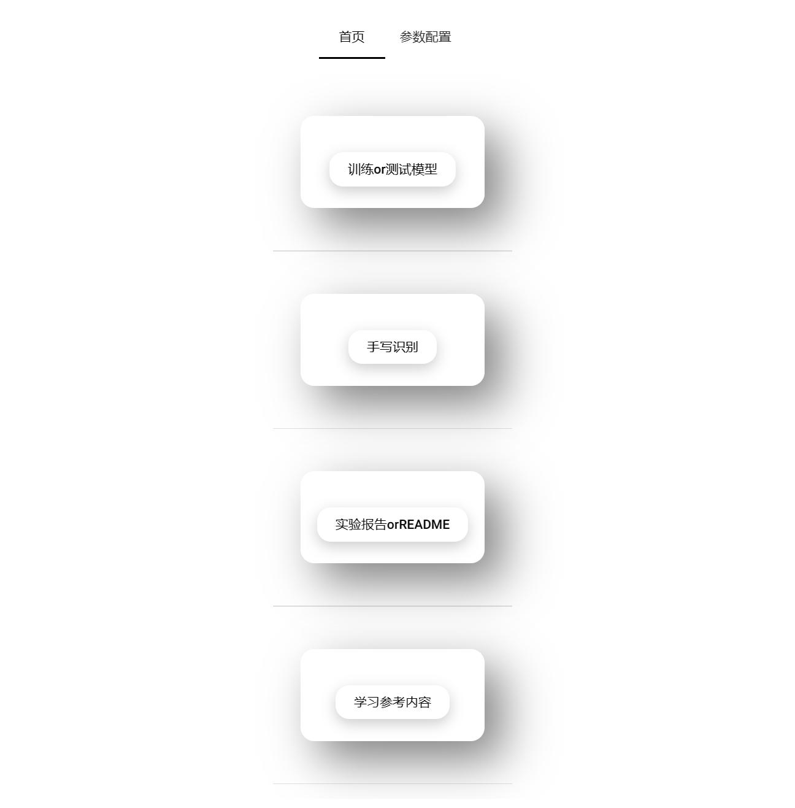
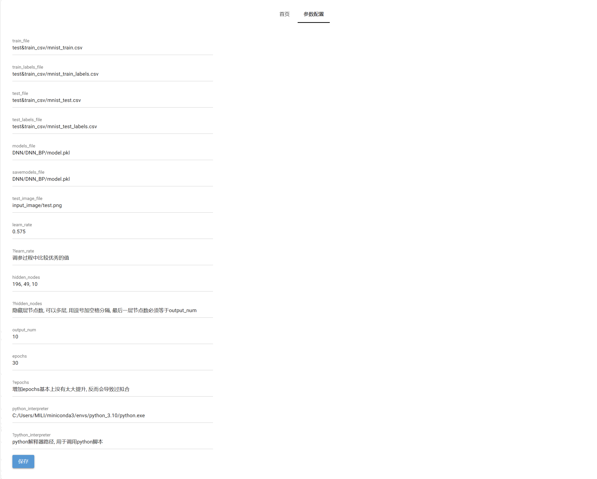
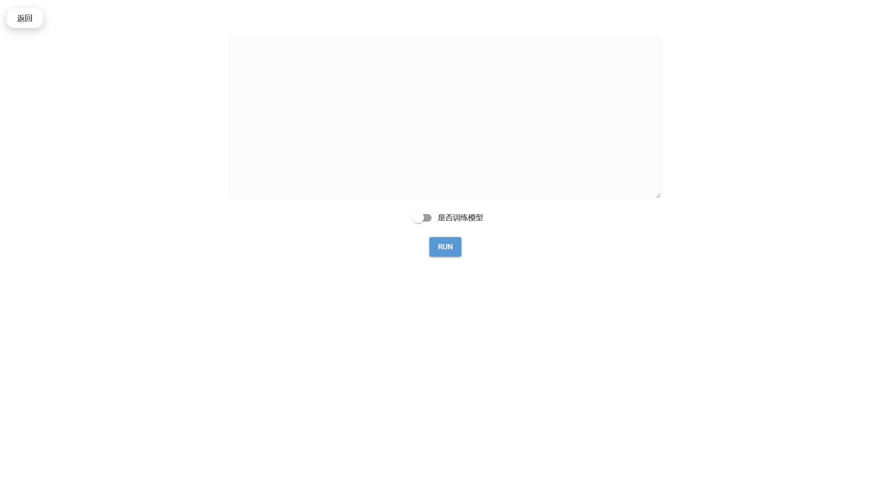
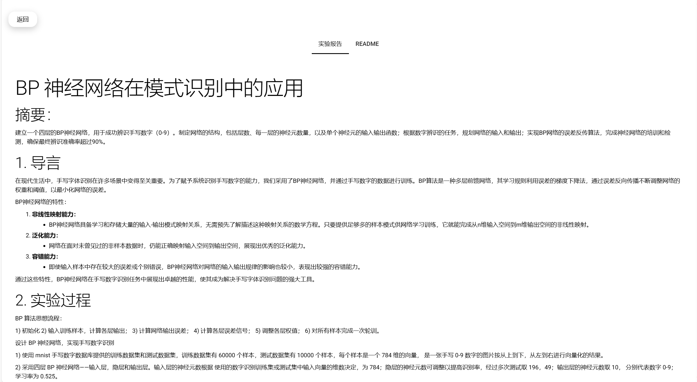
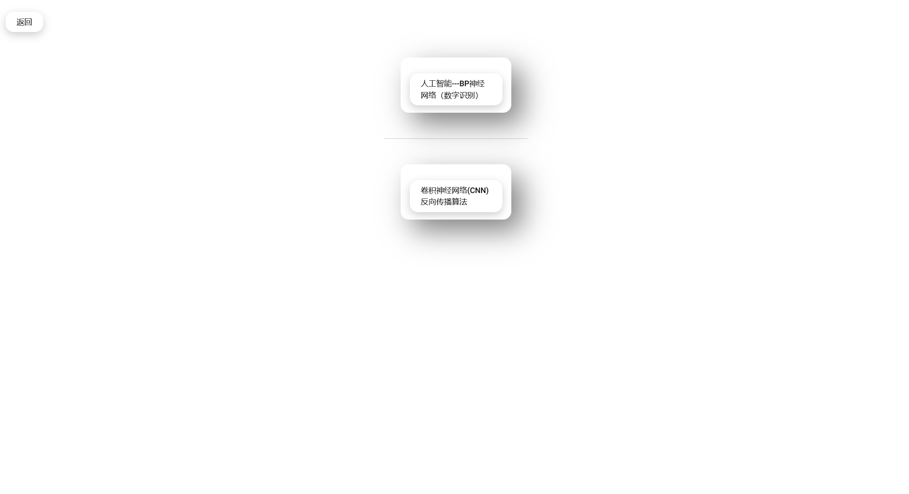

# Handwritten-digit-recognition-powered-by-Nicegui

## GUI首页

## 参数配置页面

## 训练or测试模型页面

## 手写识别页面

## 实验报告orREADME页面

## 学习参考内容页面

## 总结

该项目代码，功能皆比较简陋，旨在把之前手写数字识别的GUI实现出来为NiceGui框架的学习练手。该有的基本功能该GUI也已经实现，练手之作并不需要过多注重，因此该项目算是完结。

至于深度学习方面的部分，建议看前一个项目，讲解较为详细，本项目可以作为NiceGui的入门参考。
